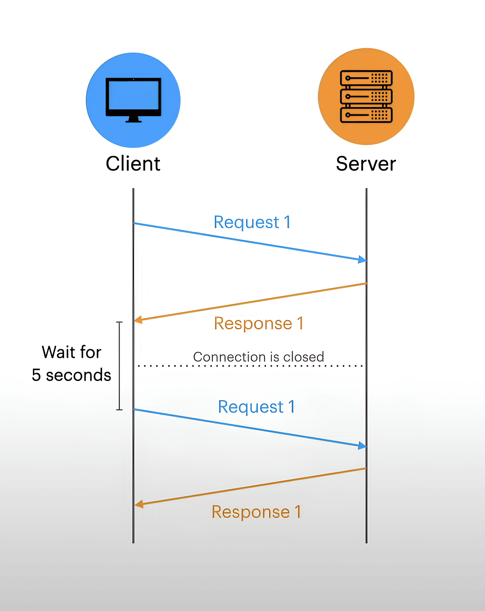
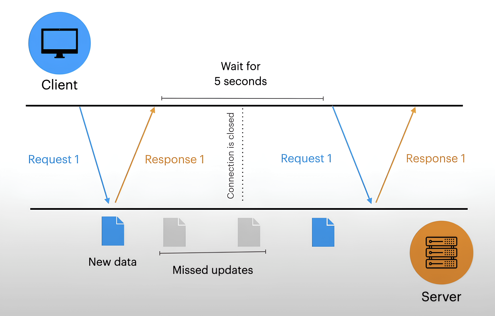
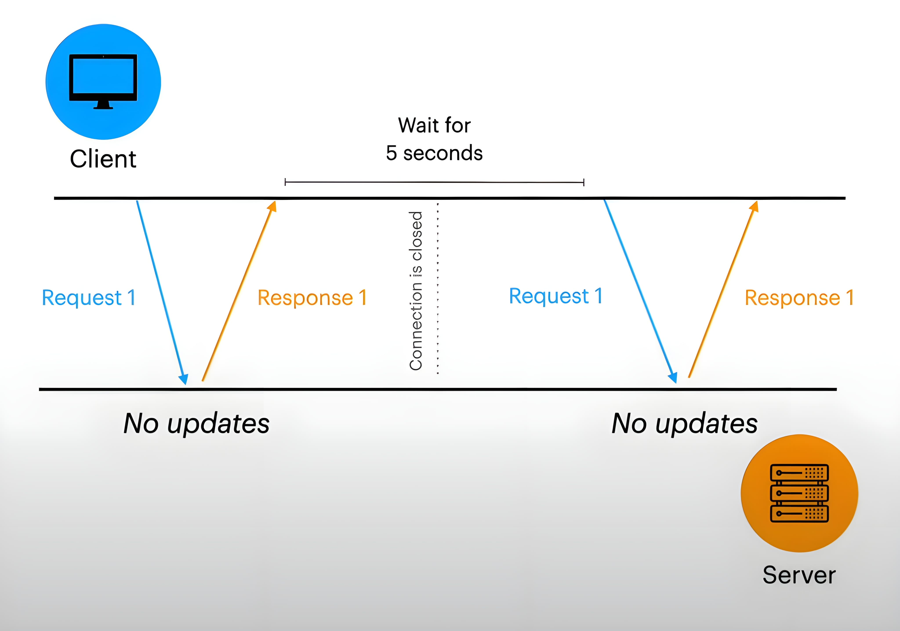

- ## What and When
	- Realtime updates usually means that we want to update UI in real time. near real time or sometimes periodically.
    - ###### When do we need real-time updates ?
        - Chat applications
        - Online Games
        - Stock applications
        - Collaborative tools (e.g. Google Documents, Figma)
- ### Poll and Push Strategies
    - Poll is when the client requests updates from the server (Long/Shot Polling).
    - Push is when the server sends messages to the client (SSE, WS).
- ### What is Comet ?
    - Comet is an umbrella term, which includes techniques and technologies that allows to create a long-hold HTTP connection and push messages from server to the client. It includes long polling, SSE and others.
- #### How typical tutorial on Medium looks like ?
    - ###### Short polling - very ineffective , don’t use it.
    - ###### Long polling - use it when the browser does not support WebSockets.
    - ###### Server Sent Events - it’s good technology, but nobody uses it.
    - ###### WebSocket - provides bi-directional connection, it’s very effective.
- #### Why the above assumptions may be not true ?
    - WebSockets is a bi-directional connection, at first. It was designed to work in certain cases, which we’ll discuss about later. It is not a universal tool.
    - ###### Why can’t I just use WebSockets every time I need real-time updates ?
        - You can! However It may not be wise to do so. Designing web applications is not only about efficiency (making it as fast as possible). It’s also about trade-offs. We can’t just pick WebSockets and not care about how many resources we’ll need for development and maintain.
        - A simple analogy : we could build a static one-page site in React, but is it worth it ? Here it is pretty much the same thing.
	- ###### Examples that may confuse :
	    - For example, LinkedIn uses Server sent Events for instant messaging
	        - Why not use Web Sockets ?
	    - StackOverflow uses WebSockets to update the interface in real time (new posts in the feed).
	        - We don’t need a bi-directional connection. Why not use Server Sent Events or polling ?
	- ###### Why is it important ?
	    - You have been assigned to design a Stock application. What will you use to update data in real time ? (asked by interviewer)
	        - Middle Software Developer : Web Sockets (answer)
	    - You have been assigned to design a Stock application. What will you use to update data in real time ? (asked by interviewer)
	        - Senior Software Developer : Lets look at the business requirements and resources that we have. (answer)
- ## Short Polling  
	- ###### Short polling is when client (browser) periodically asks the server for updates. Let’s say every 5 seconds.
	- ### Pros :
	    - Require no additional work on the server side
	    - Works over HTTP.
	    - Doesn’t need a persistent connection
	- ### Cons :
	    - Inefficient solution in many cases
	- ### Short Polling. Why is it inefficient ?
	    - ###### Short Polling. Frequent or Random Updates 
		    - ###### Why is it a problem ?
			    - When updates happen more often than we make a request to the server, we risk missing a lot of information.
		- ###### Short Polling. Useless Requests 
		    - ###### Why is this is a problem ?
		        - If the updates. are very infrequent, most requests will be useless, i.e. there will be a waste of resources.
	- ### Short Polling. When it may be useful ?
		- ###### No access to server code
			- If we don’t have access to the backend code, the only thing we can do is periodically request updates on the server.
		- ###### We just want to update data periodically
			- We want to update the interface periodically, but we don’t want real-time updates.
		- ###### Data is updating with known interval
			-  If we know that update occur , for example every 5 minutes, it may be inefficient to maintain a constant connection
		- ###### We need the simplest, possibly temporary solution.
			- Short polling are by far the easiest solution in terms of design and maintenance.
	- ### Short Polling. When we should avoid it ?
		- ###### Real-time updates is required
			- Short Polling does not provide real-time updates.
		- ###### Updates happen rare of randomly
			- In such cases, most requests will be useless.
	- ### Short Polling. Scaling
	    - Scaling is the ability of a system , network or process to handle an increasing amount of work by adding resources
	        - There are two types of scaling.
	            - Vertical Scaling or Scaling Up (add CPU, RAM etc)
	                
	                
	                
	            - Horizontal Scaling or Scaling Out (add servers)
	                
	                
	                
	    - Load Balancer
	        
	        
	        
	        - A load balancer is a component of a system that is responsible for distributing input traffic. Simply put , it decides which server to send a request to based on various factors such as server load, the least Server of requests sent and others.
	    - What problems we may struggle ?
	        
	        - The Short Polling Scalability has no special requirements.
	            
	        - Suppose we are developing a stock application. One of the functional requirements is to update stocks every minute.
	            
	        - What can we do if the number of clients has become too large ?
	            
	            - We can simply add more CPU and RAM to the server.
	                
	                
	                
	        - What if we reach the limit ?
	            
	            - Then we must do Horizontal Scaling.
	                
	                
                
- ## Long Polling
    
    
    
    - Long polling is a technique in which a clients’s HTTP request is held by the server until new data becomes available.
    - Pros :
        - It is more resource-efficient compared to traditional polling methods.
        - Provides near real-time updates with minimal delay.
    - Cons :
        - Requires maintaining a persistent connection, which adds complexity.
        - Needs additional server-side implementation efforts.
        - More challenging to scale horizontally; it can’t easily shift to another server under high load.
        - Long polling operates over standard HTTP, resulting in extra HTTP overhead.
        - Not designed for real-time interactions like technologies such as WebSockets (WS) or Server-Sent Events (SSE).
        - Updates are not in real-time, Each update requires opening a new connection rather than reusing an existing one, leading to potentially higher latency.
        - Requires the implementation of a message queue on the server to handle updates that occur during reconnections, ensuring message order.
        - Can lead to sticky sessions, which are detrimental to scalability.
    - Long Polling. When we may use it :
        - We need real-time updates for older browsers
            - Long Polling
        - Messages from the server don’t come to often
        - Why not just user Server Sent Events instead of Long Polling ?
            - The implementation of SSE is very simple. However, in some cases we may still prefer Long Polling. For example, if the browser does not support SSE, we should switch to Long Polling. SSE also does not allow passing headers, which may be necessary in some cases.
            - As you can see, despite the simplicity of SSE, Long Polling is still the simplest and most widely supported solution for real-time updates.
    - Long Polling. When we should avoid it
        - We need an efficient bi-directional channel
            - We can emulate a bi-directional connection using Long Polling and a normal HTTP request. However, if we need minimal latency, it is better to use WebSockets.
        - The infrastructure is not ready for a large number of persistent connections.
            - Imagine a situation: we receive updates from a third-party service about every 5 minutes. Would it be efficient to maintain persistent connections to receive updates? Probably not, in which case we should use Short Polling
        - HTTP Overhead is a problem
            - If we want to minimise the overhead of HTTP, we can switch to Server Sent Events.
    - Long Polling Problems
        - Long Polling. Delay
            - Why is this a problem ?
                
                
                
            - There may be a delay in updates if they occur during the reconnect phase.
                
    - Long Polling. Scaling
        - Scaling for long poling is much interesting!
            
        - Before we get started, we need to understand the difference between Stateless and Stateful server architecture.
            
            
            
        - Let’s take a look at what can happen if we start scaling Stateful servers.
            
            
            
        - Solution #1. Sticky Session
            
            
            
        - Solution #2. Shared Storage
            
            
            
        - Sticky Session vs Shared Storage
            
            - Sticky Sessions are only needed if we implement Stateful Architecture on the server.
            - However, if the server is down, Sticky Session won't help us save the data.
            - Sticky session:
                - Easier to implement
                - Leads to uneven distribution of connections between processes/hosts
                - Data will still be lost if the server goes down.
                - Good for short-lived or non-critical data. Example: file uploads.
                - Allows attackers to attack specific hosts on your system (DoS/DDoS vulnerability). An attacker can trick a load balancer and cause a denial of service to a specific node.
            - Shared data storage:
                - Difficult to implement and maintain
                - No impact on load balancing
                - Data is stored in shared storage, which is much safer.
                - Good for long-lived or critical data. Example: user data.
        - Why it’s not a problem for Short Polling ?
            
            - Let's try to imagine a typical case where we use Short and Long Polling.
            - Short Polling is not used for real-time updates. Suppose we are developing an analytics application. How can we update the data on the server if we use Stateful model? There is no way, we will have to update the data in the database. We will definitely not store such information on the server.
            - Another case: we use a long poll to track the file uploading process in real time. In this case, using Stateful architecture makes sense (data is short-lived).
            - Thus, sticky sessions and related issues are not related to Short Polling, because they just used in different scenarios.
- Server Sent Events
    
    - Server-Sent Events (SSE) is an implementation of **Comet** in which a client establishes a connection to a server, allowing the server to directly send messages to the client. Unlike Short/Long polling, SSE is not just a hack, but a push technology that allows the server to send messages to the client.
        
        
        
    - Pros:
        
        - Provides real-time updates.
        - Compatible with most proxy servers, load balancers, etc. due to working over plain HTTP.
        - Reduces HTTP overhead to an average of 5 bytes, compared to 8 bytes for traditional polling.
        - Supports various features such as automatic reconnection, event names and event IDs.
        - Compared to HTTP 2, it offers multiplexing. This allows multiple SSE connections to be opened over a single TCP connection.
        - Allows Connectionless messaging to save battery power on mobile devices.
        - Uses plain HTTP, allowing polyfills to be used with vanilla JavaScript.
        - Familiar, event-driven interface for most frontend developers.
    - Cons:
        
        - Requires a persistent connection.
        - Requires additional server-side implementation.
        - Less browser support compared to polling and WebSockets.
        - Less efficient traffic compared to WebSockets.
        - Cross-domain connections require appropriate CORS settings.
        - Limited to 6 concurrent connections per browser on HTTP version below 2, for more connections an upgrade to HTTP 2 is required.
    - Server Sent Events. When we may use it
        
        - We need one-directional channel for real-time updates
            - If browsers support is not an issue, and we don't need bi-directional connection, SSE is a good choice.
        - Server sends messages frequently
            - In such case HTTP overhead can be a problem, so it is advisable to switch from Long Polling to SSE.
        - Battery life is a concern
            - SSE supports Connectionless Push. For SSE, we have to maintain a constant connection, which can have a negative impact on battery life on mobile devices. Connectionless Push allows the device to go into sleep mode between messages. This can be an advantage over WS.
    - Server Sent Events. When we should avoid it
        
        
        
        - We need a bi-directional connection
            - In this case, we should probably switch to WebSockets. We can emulate a bi-directional connection using SSE + HTTP Request, but using WS would be more efficient.
        - The server sends messages very frequently
            - In such case HTTP Overhead can become a problem, so it is advisable to switch from Long Polling to WS.
    - Server Sent Events. Example cases
        
        - Real-time notifications: news, social feeds.
        - Real-time updates: sporting events, crypto-currencies, realtime analytics.
        - Progress updates: any lengthy process.
        - Monitor server statistics such as uptime, status and running processes.
- Web Sockets
    
    
    
    - Web-Socket is a bi-directional channel that allows communication in both directions:
        - client-server
        - server-client
    - Pros :
        - Bi-directional channel.
        - WS provides less latency and lower overhead for message passing as WS runs on a different protocol and is independent of HTTP.
        - Better browser support compared to SSE.
        - Support for binary data transfer, which reduces the payload size compared to text-only approaches. You can also transfer binary data such as images, etc.
        - With WebSockets, you can connect to a server from another domain (no CORS required).
    - Cons :
        - WS is more complex to implement and maintain. WS runs on a different protocol (ws and wss for secure Web Sockets). This can cause roblems with some proxy servers, firewalls, and load balancers that are configured to work with HTTP.
        - WS does not support HTTP features such as multiplexing
        - Browser support is worse compared to polling.
        - Horizontal scaling requires additional work.
    - Web Sockets. When we should use it
        - We need a bidirectional channel
            - If our application really needs a bi-directional connection, we should use WebSockets.
        - Maximising efficiency is crucial
            - Even if we need a bi-directional connection, we can emulate it with SSE and HTTP Request (or Long Polling and HTTP Request).
            - However, if we want maximum efficiency (low latency and low overhead), we should go for WebSockets.
    - Web Sockets. When we should avoid it
        - We don't need bidirectional communication.
            - In many cases, we just need near real-time updates. In such cases, WS will definitely be an overhead.
        - Our infrastructure is not ready to work with WS protocol.
            - In this case we can switch to SSE + HTTP Requests.
        - We need the features that HTTP2/SSE can provide.
            - WS don't work over HTTP. HTTP 2 provides many interesting capabilities that may be very desirable. When we choose WS, we cut off the features of HTTP.
        - We don't understand the risks
            - Keep in mind that WS uses a different protocol, while most of the IT infrastructure (proxies, load balancers, etc.) is used to working with HTTP. This can lead to unpredictable problems.
    - Web Sockets. Example cases
        - Collaborating tools ( Google Docs, Figma etc)
        - Multi-player games
        - Chat Applications
    - Are Web Sockets really efficient ?
        - Let’s look at the graphic.
            
            
            
        - While for infrequent updates these transport overheads are not as issue, for a highly interactive multiplayer game they can be a problem.
            
    - Web Sockets possible problems
        - Scaling
            
            
            
        - Pub / Sub
            
            
            
        - Re-inventing HTTP
            
            - Web Sockets - 50 connections for 50 tabs
            - HTTP/2 - 1 connection for 50 tabs
            - Let’s take Chat Application for example
                - How to implement ?
                    - Use multiple WebSocket connections
                        - Each group has independent WebSocket connection. This approach is more reliable and easier to maintain. However, it may be very inefficient.
                    - Add markers
                        - We can add additional field to each WebSocket message to distinguish them from each other. However, in this case we would have to send additional overhead with each message.
                - Sharing data between tabs
                    - In the case of WebSockets, this can be an even bigger problem as they do not support multiplexing
                        - Tab 1 → 4 TCS connections
                        - Tab 2 → 4 TCP connections
                    - How to fix ?
                        - Use HTTP2
                        - Using SharedWorker
                        - Use Broadcast channel
                        - Use Browser’s Storage
                        - Do nothing
        - Infrastructure
            
            
            
        - Authentication
            
            - Authentication with cookie is not suitable for all applications, and WebSocket API does not allow to specify a token in the Authorisation header. That is, unlike regular HTTP, there is no standard way to implement an authorised connection via WS.
            
            - How we can solve this problem?
                - Using query params (URL) to send access token
                    
                    - We can use something like: wss://website.com?token=your_token. If the token is invalid, the connection will be refused.
                    - This can be relatively safe if:
                        - Using TLS (WSS), request strings are encrypted in transmission.
                        - Compared to HTTP, WebSocket URLs are not revealed to the user. Users cannot copy and paste URLs.
                    - However, the request parameters will still appear in plaintext on the server, where they are likely to be logged. Even if we don't do this, some proxy servers between client and server can do this (Cloud Provider). Remember that TLS only encrypts data in transit.
                - Using cookies
                    
                    - Since we have to use HTTP Handshake before establishing a WS connection, cookies are still possible. In this case, it is necessary to deploy the WS service on the same domain as the web application, otherwise cookies will not be sent.
                - Using short-lived token to authentication
                    
                    
                    
                    - We can use an additional token for authentication. In this case, even if the token is stolen, it will be useless because it has a very short lifetime.
                    - The problem with this approach is that we need an additional service to work with WS-tokens.
                - Using Sec-WebSocket-Protocol HTTP header
                    
                    - The initial HTTP request (handshake) may contain a Sec-WebSocket-Protocol header. We can use it to send a token.
                    - The disadvantage of this approach is that such a header is not designed for curity, like the Authorisation header. This means that it can be read by proxy servers as plain text and logged. We may also encounter unexpected behaviour as not all proxy servers and middleware know how to handle this header as there is no standard for it.
                - Send Auth Token with the first message
                    
                    
                    
                    - The server checks this token and, if it is invalid, closes the connection. This is more secure than the first approach and simpler than the second.
                    - The problem with this approach is the vulnerability to DDoS attacks. Anyone can open a WS connection to our server, which is not possible in the previous cases where the server can refuse the connection if there is no valid token in the URL.
    - WebSocket Recommendations
        - Always prefer frameworks that provide multiple transport protocols with automatic fallback.
            - For example, socket. io switches to long polling if the browser does not support WebSockets.
        - Always deploy your realtime backend over TSL if possible.
            - Using encrypted protocol is more secure and also it helps to bypass possible problems with proxies and load balancers.
        - Prefer using a framework/library over building it yourself.
            - There are tons of little edge cases that take many months to handle.
        - Do not use WebSocket everywhere
            - In some cases WebSockets may be a good fit and the best tool for the job. Games often require ultra fast full duplex communications.
- Summary
    
    - Short Polling
        - Use cases: Updates every N seconds/minute (not in real time) suit business requirements.
        - Example Apps: Analytic Apps, Stock Apps.
        - Key advantages: Simplicity
        - Key disadvantages: Very inefficient in terms of network traffic; doesn't provide real-time updates.
    - Long Polling
        - Use cases: We need near to real-time updates.
        - Example Apps: Analytic Apps, Stock Apps, Social Networks.
        - Key advantages: Works over HTTP (inherit HTTP2 features), widely support.
        - Key disadvantages: Possible delay between updates, up to 3 iterations (response-request-response); HTTP overhead
    - Server Sent Events
        - Use cases: We need real-time updates.
        - Example Apps: Analytic Apps, Stock Apps, Social Networks. Possibly Chat Apps.
        - Key advantages: Works over HTTP (inherit HTTP2 features), adds many unique features (re-connection, event ID, connections pushes)
        - Key disadvantages: HTTP overhead
    - Web Sockets
        - Use cases: We need bi-directional connection.
        - Example Apps: Collaborations tools (Google Docs, Figma). Multiplayer Games, Chat Apps.
        - Key advantages: Very efficient in terms of network traffic. Minimum delay between messages.
        - Key disadvantages: Works over ws protocol, which may lead to the problem with infrastructure compatibility. Doesn't have HTTP2 core features such as multiplexing.
- XXX